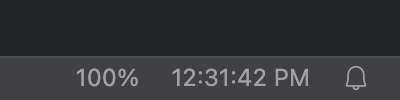
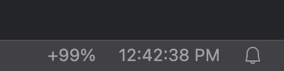

# Lifeline

A Visual Studio Code extensions that shows a clock and the current battery state in the status bar.

## Features
Lifeline presents the time and battery level of your laptop in the bottom right of the status bar. It tries to always be the the rightmost item. By default, it displays the time on the right and the battery on the left. You can swap the positioning (and the time format) in the extension settings.

Lifeline will also show that your laptop is charging.

## Preview
| Device unplugged | Device charging |
| - | - |
|  |  |

## Configuration
### `lifeline.clock.format`
Sets the datetime display format for the clock. By default, set to `h:mm:ss A`.

### `lifeline.swap`
Swap the display order of the battery and clock. By default, set to `false`.